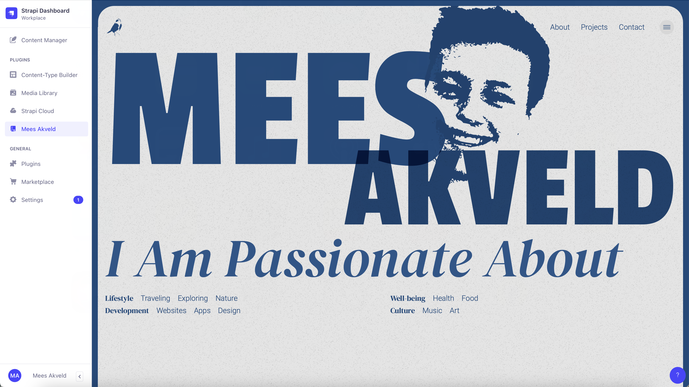
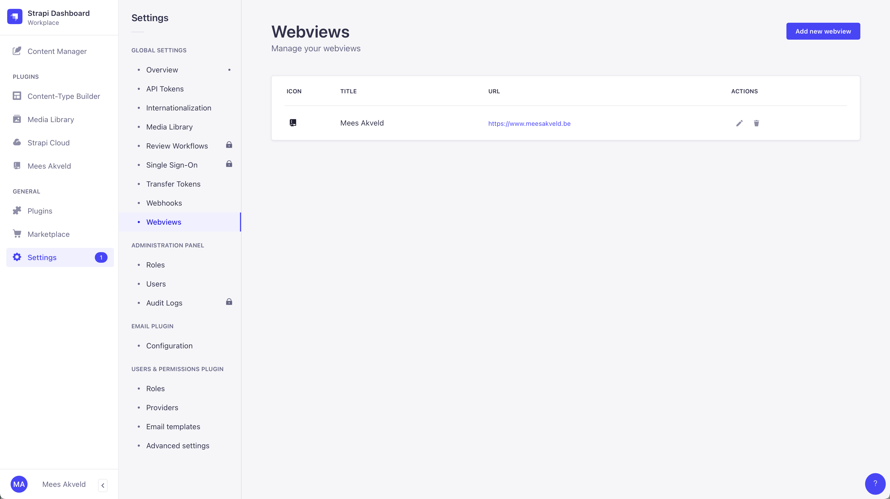
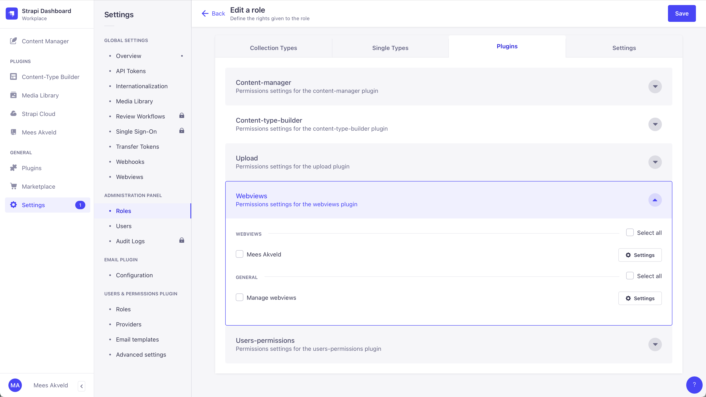

# Strapi plugin Webviews

With Webviews, you can create custom webview components in Strapi that will be rendered in the admin panel.

## Screenshots





## Installation

1. Clone this repository inside the plugins folder of your Strapi 4 project. If there is no `plugins` folder, create one within the src folder.
2. Add the prebuild script in your package.json of your Strapi 4 project.
    ```json
    "scripts": {
        // ...
        "prebuild": "cd src/plugins/webviews && npm run build",
        // ...
    }
    ```
3. Local: `npm run build  && npm run develop` 
    
    (Add ` -- --watch-admin` at the end if you would like to make changes without constantly refreshing)